## 🎬 SHITAI 画面イメージ集

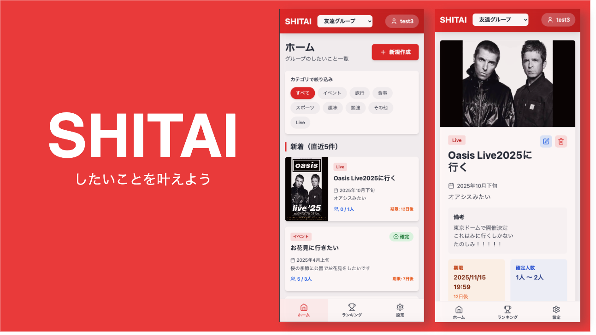

このドキュメントでは、サービス「SHITAI」の各画面イメージを紹介します。 
実際の UI を確認することで、利用者が操作の流れを直感的に理解できるようにしています。

### 🏠 ホーム画面

グループ内の「したいこと」を一覧で確認できます。 
新着順・期限接近順などのタブで切り替えが可能です。

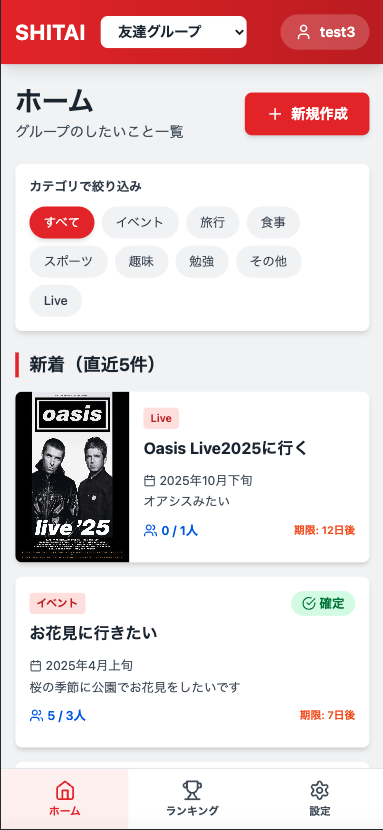

### 🏆 ランキング画面

未確定の「したいこと」を参加人数順に表示します。 
もっとも人気のある企画が一目で分かります。

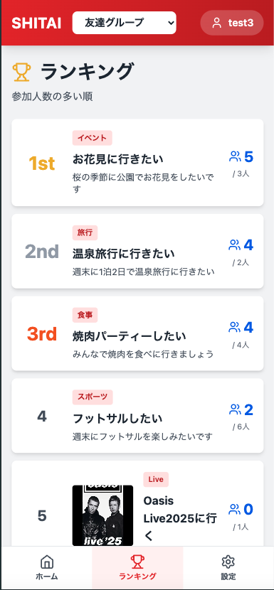

### ✏️ したいこと作成画面

ユーザーが新しい「したいこと」を投稿するための画面です。 
タイトル、カテゴリー、画像、期限、参加確認項目などを設定できます。 

| 画面名                                     | 説明                                     |
| ------------------------------------------ | ---------------------------------------- |
| 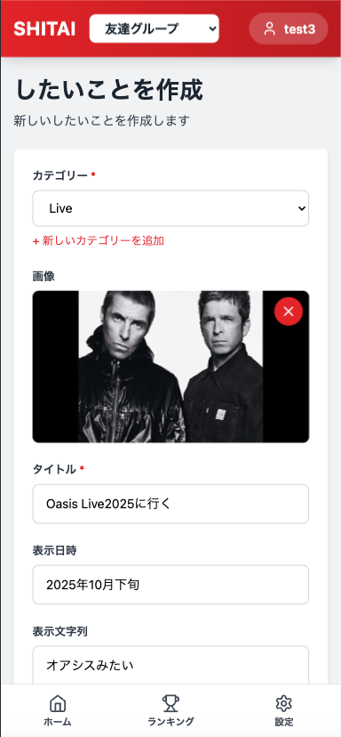  | 基本情報（タイトル、カテゴリ、画像）入力 |
| 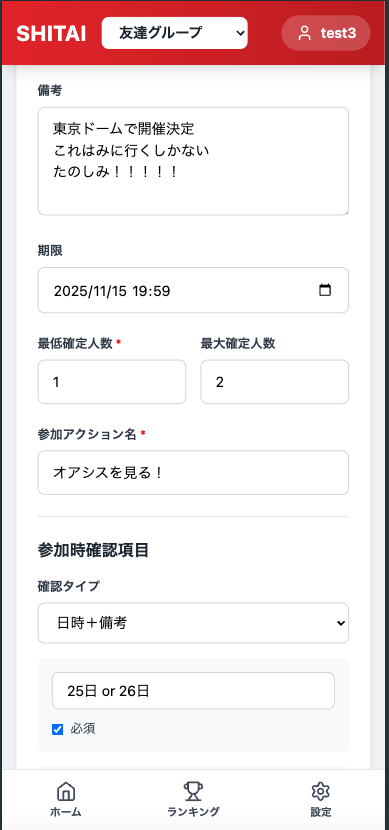 | 参加条件・期限・人数設定                 |
| 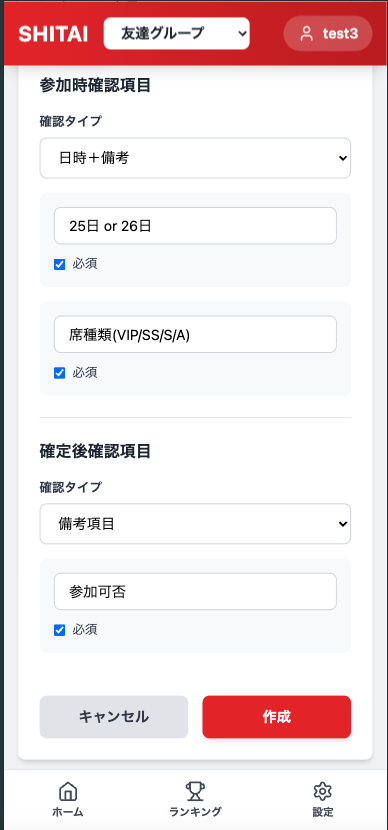 | 参加時／確定時の確認項目設定             |

### 🔍 したいこと詳細画面

投稿された「したいこと」の詳細を確認できます。 
現在の参加人数や締切、備考などを表示し、「参加する」ボタンから参加可能です。 

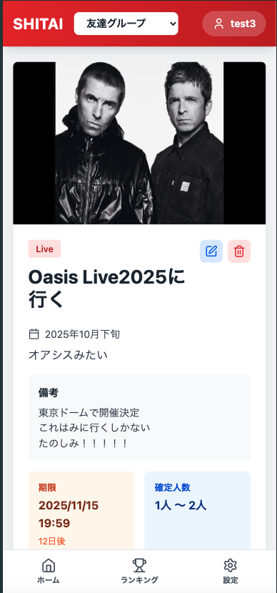
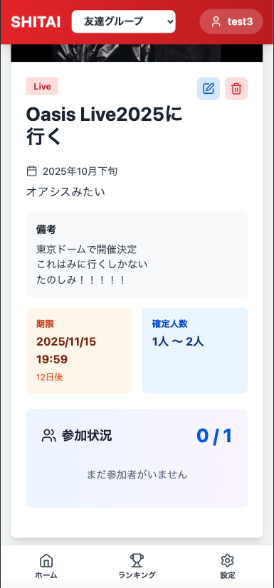

### 🔍 各ユーザーごとのしたいこと参加状況確認画面

どのユーザーがいつどのしたいことに参加しているか確認することができます。 
参加状況を確認することにより、したいことの実施日を決めやすくなります。 

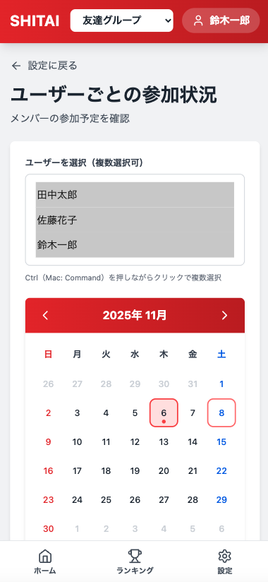
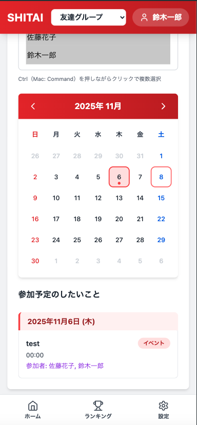

### 🧾 参加時の確認入力画面

「参加する(下記ではオアシスを見る！)」ボタンを押した際に、日時・備考などの追加情報を入力する画面です。

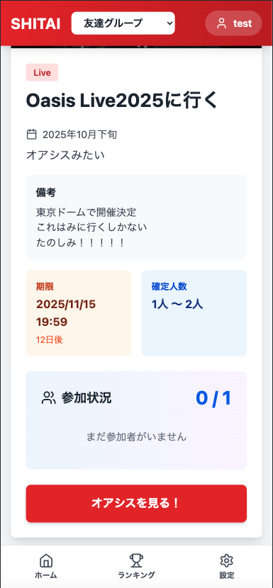

### ✅ 確定後の画面

募集が確定したあとの表示です。 
確定した参加者一覧や、確認項目入力フォームを含みます。 

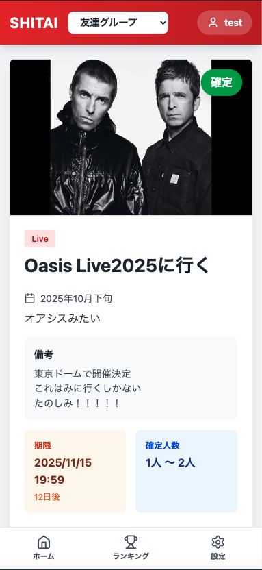
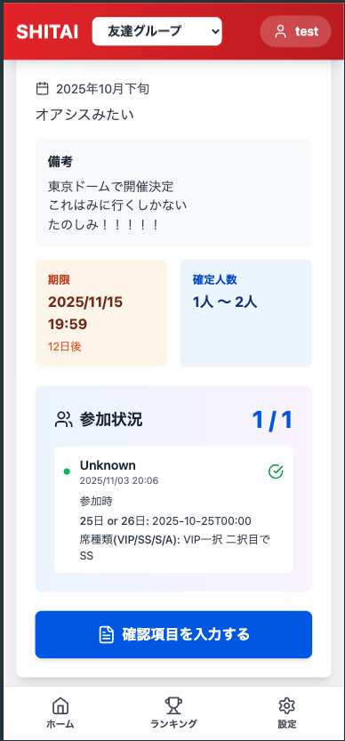
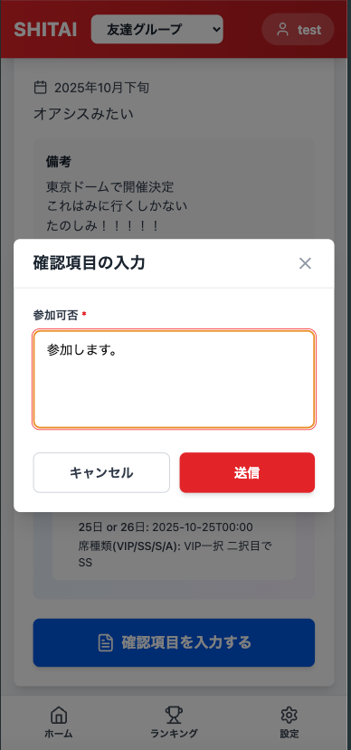
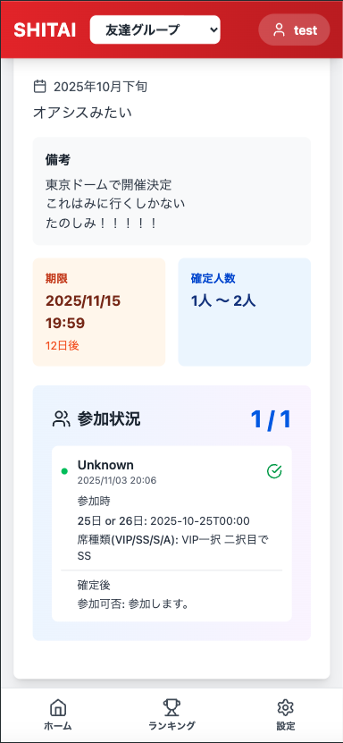

### 🔐 ログイン画面

ユーザーがアカウントにサインインするための画面です。 

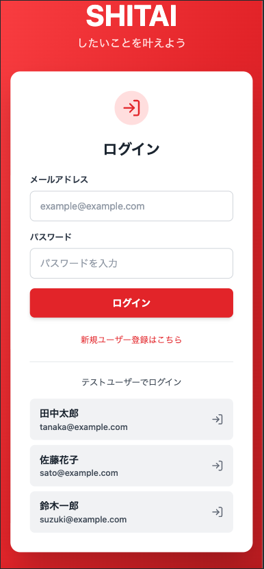

### ⚙️ 設定画面

グループ作成や招待、自分が作成した「したいこと」一覧へのアクセスなど、 
マイページ的な役割を持つ設定エリアです。 

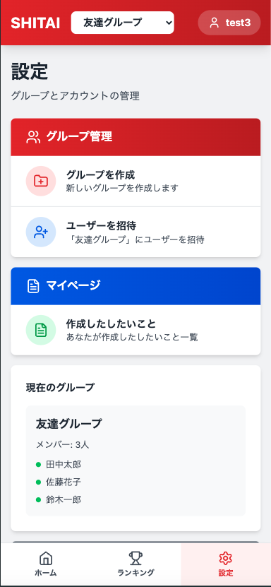

🖼️ 使用上の注意

各画像はデモ用サンプルです。

実際の画面デザインは今後アップデートされる可能性があります。
